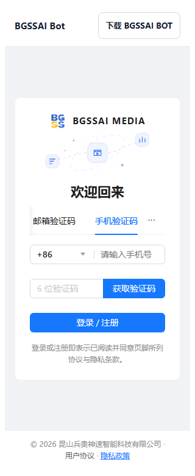

# 协议入口去重验证 · bgssai-media

2026-09-29；基线 `ff2f0f65ea6001a0cff9a9f385734bb771703120`；工作分支 `codex/legal-dedup-20260929`，交付目标 `develop`。

登录提示、全局页脚和设置页按[需求](../../feature/legal-entry-dedup.md)分工，避免同页重复列出协议。同步[交互原型](../../demo-static/web/user/legal-entry-dedup.html)与[设计](../../architecture/legal-entry-dedup.md)。原认证和同意校验保留。

| 前端目录 | 验证命令 | 结果 |
|---|---|---|
| `bgssai-media-admin/frontend` | npm run build | PASS |
| `bgssai-media-user/frontend` | npm run build | PASS |

- 构建完成；本地 Chromium 在 320px / 1440px 检查 12 个登录、注册路由或回退、返回登录场景。管理端 `/register` 仅检查不存在路由的回退行为，没有新增注册。
- 验证可见协议链接数量与目标、页面横向溢出、协议与备案链接点击可达性、运行时错误；均通过。
- 设置/账户场景 0 个，补充语言/法务路由/勾选框场景 0 个，均通过。
- 本仓已有协议专项测试 1 组、前端回归测试 0 组通过；详细目录与退出码见 [verification.json](verification.json)。未列出的后端或端到端测试不计为通过。
- `git diff --check` 在提交前通过。构建生成的后端静态资源已恢复，PR 交付源码和说明，由现有流水线生成发布产物。

验证使用本地构建和模拟 API；未通过真实账号执行业务写操作，也未进行原生真机打包验证。当前尚未合并或发布；dev/prod 均应在合并后由 Jenkins 部署 `develop`，分别使用对应 properties。
