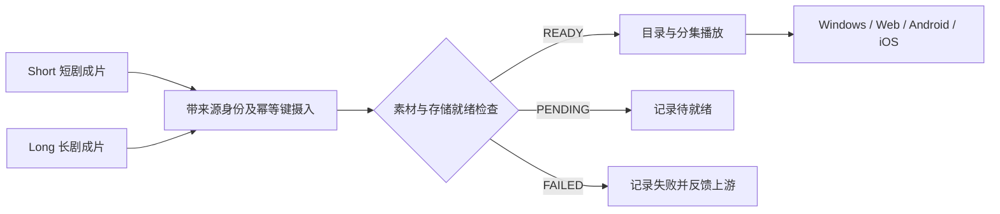

# Media 产品定位与交付核查（2026-10-06）

源码基线：`15f137fc26f242bbf06d39e892099bdb8ebafb57`（远端 develop）。本记录校准既有定位、参考范围和实现说明，不新增接口、状态、页面或数据库契约。以下是源码核查；打包配置、样本文件、接口或单测存在都不能替代真实播放验收。

## 产品定位

`bgssai-media` 同时提供播放器和视频播放平台。播放器参考 VLC；平台对标 YouTube 的正片/剧集与 YouTube Shorts 的竖屏视频体验。`bgssai-short` 制作短剧，`bgssai-long` 制作长剧，两者的真实成片可直接发布到 Media，再由 Media 承接目录、分发和播放。

用户要求的播放交付端是 Windows PC 桌面软件、Web 在线、Android、iOS。每个安装端交付一款应用；既有用户/管理双入口约定继续适用。本地播放器与平台入口需要在最终桌面产品中联通，不能把当前两个模块分别存在写成一个完整桌面产品已交付。

VLC 参考快照：[22479ecffc](https://github.com/videolan/vlc/tree/22479ecffc01bb4e6ad8ddedff257a1d8c7820a5)。本次读取工作区 `reference-github/vlc`；没有复制其源码到产品仓。Short/Long 的制作参考仍是 waoowaoo、Jellyfish、ArcReel、LocalMiniDrama、openframe、ZJT。

## 当前实现证据与边界

| 范围 | 当前源码 | 可得结论 |
| --- | --- | --- |
| Short/Long 摄入 | [ShortDramaContractService](../../bgssai-media-common/src/main/java/com/bgssai/media/common/service/ShortDramaContractService.java)、[LongDramaContractService](../../bgssai-media-common/src/main/java/com/bgssai/media/common/service/LongDramaContractService.java) | 两条摄入、目录及幂等处理路径已存在，尚需上游真实成片联合验收 |
| Web 平台 | [路由](../../bgssai-media-user/frontend/src/router/index.tsx)、[UniversalPlayer](../../bgssai-media-user/frontend/src/components/UniversalPlayer/index.tsx) | 已有目录/分集、`/shorts`、`/shorts/:mediaId`、`/player`、`/continue` 等；没有 `/short` 或 `/long` 页面路由 |
| Web 本地文件 | [UniversalPlayerPage](../../bgssai-media-user/frontend/src/pages/UniversalPlayerPage.tsx) | 使用浏览器 Blob URL；能选文件不代表浏览器能解码任意容器或编码 |
| Windows 本地播放器 | [VlcPlayer](../../bgssai-media-desktop/electron/vlc-player.js)、[打包配置](../../bgssai-media-desktop/package.json) | Electron 通过 RC 控制外部系统 VLC，解码/播放窗口由 VLC 承担；不是已完成的内嵌 libVLC 播放器 |
| Windows 产品壳 | [主进程](../../clients/desktop/electron/main.js)、[打包配置](../../clients/desktop/package.json) | 双入口 Web 壳与文件关联声明存在；主进程未实现关联文件的播放分派，也未接入独立 VLC 播放器模块 |
| Android/iOS | [移动壳配置](../../clients/mobile/capacitor.config.json)、[移动壳依赖](../../clients/mobile/package.json)、[客户端状态](../../CLIENTS.md) | Capacitor 脚手架；本仓未包含已交付的原生播放器桥接或真机安装验收证据 |

## 主流格式的验收口径

格式以“容器/传输 + 视频编码 + 音频编码 + 端/系统版本 + 样本”为单位记录，不能只根据扩展名承诺支持。

| 类别 | 样本范围 | 当前路径与验收边界 |
| --- | --- | --- |
| 常用视频文件 | MP4、MKV、WebM、MOV、AVI、FLV、WMV、TS、MPG、3GP | Windows 的 VLC 路径以实际安装引擎和样本验证；Web 与移动 WebView 不能继承 VLC 的格式矩阵 |
| 视频编码 | H.264、H.265/HEVC、AV1、VP9、MPEG-2 | 同一 MP4 可装不同编码；逐端验证声画、拖动、硬件解码和错误提示 |
| 音频文件/编码 | MP3、AAC/M4A、OGG/Opus、FLAC、WAV/PCM、APE、ALAC、WMA | 桌面按 [现有矩阵](../feature/format-matrix.md) 验收，移动端原生支持范围待桥接与真机验证 |
| 在线流 | HLS `.m3u8` 及其分片 | HLS 是流清单/传输方式；验证清单、分片、跨域、音轨、跳转及访问权限，不按单一文件扩展名验收 |
| 字幕及音轨 | 内嵌/外挂字幕、多音轨、偏移 | 当前不能由格式清单推导全部功能可用；分别验证选择、同步与恢复 |

Web 在线交付优先验收浏览器友好的 MP4（H.264/AAC）、WebM 和 HLS。不兼容源文件需有经验证的服务端转码输出；“上传成功”与“转码任务存在”均不等于浏览器已能播放。原始文件可保留供具备解码能力的客户端使用。Android/iOS 本地文件广格式播放需完成原生播放能力后逐样本验收，远程网页壳不能替代该能力。

## 跨仓交接核查

契约分别见 [Short 摄入](../contracts/short-to-media-publish.md) 和 [Long 摄入](../contracts/long-to-media-publish.md)。

READY 是当前摄入就绪状态，不能代替设备上实际声画播放证明。接入测试还须验证权限、源地址生命周期及转码输出。

Long 的现有联合差距需要优先处理：上游将数据库分集 ID 作为 `source_episode_id`，Media 从它推导显示 `ep_no`；上游另直接发送 `approved=true` 与 `duration_sec=0`。这不能证明实际集序、审核来源和时长正确。证据：[固定基线的 Long PipelineService](https://github.com/liuliuzo/bgssai-long/blob/395ff075df15cad9e8d1afc3791145ddfb872b23/bgssai-long-common/src/main/java/com/bgssai/longai/service/PipelineService.java)。这些是后续联合实现事项，本次不更改字段语义。

## 分阶段交付与通过条件

| 顺序 | 范围 | 必须取得的证据 |
| --- | --- | --- |
| 1 | Short/Long → Media Web | 各取真实成片；Long 至少两集并加入交错作品；源身份、审核与时长正确；目录可见、声画可播、幂等安全、PENDING/FAILED 可区分 |
| 2 | Windows 单应用 | 在同一产品内访问平台和本地播放；从资源管理器文件关联打开；验证引擎存在/缺失、安装/卸载、格式样本、字幕音轨与播放控制 |
| 3 | Android/iOS | 每端一个应用；在线播放与本地文件播放能力分别验证；真机覆盖文件权限、系统选文件、全屏/旋转、前后台恢复和相同平台条目 |
| 4 | 平台观看体验 | 验证竖屏切换、正片/剧集连播、多清晰度、继续观看与权限；以对应需求及实际客户端行为验收 |

每项记录源码 SHA、安装包版本、设备/系统、样本的容器与编码、操作及结果。Windows/Web/Android/iOS 分别给出通过/失败/未执行；不得用一种浏览器的结果替代四端。

后续实际功能变更须先定需求、HTML 原型、详设，再同步代码与 SQL；跨仓字段需双方同版本交付。dev/prod 均部署 develop，分别使用 `application-dev.properties` / `application-prod.properties`。

## 本次交付边界

本次验证：完整 `mvn -B -ntp test` 编译/测试成功，共 126 项，失败/错误/跳过为 0；桌面现有 VLC 定位/状态测试 `node --test test/vlc-locator.test.js test/vlc-status.test.js` 共 9 项通过。修改文档的本地链接存在性检查与 `git diff --check` 通过。Node 测试验证定位与错误状态，不代表真实 VLC 格式解码 smoke 或安装包验收。

本次仅订正文档并整理核查证据。原型、API、代码和 SQL 不涉及修改，理由是未改变对外契约、播放行为或表结构。本次未部署、未执行线上数据库脚本、未打包发布客户端、未完成真实成片跨仓与四端播放验收。
